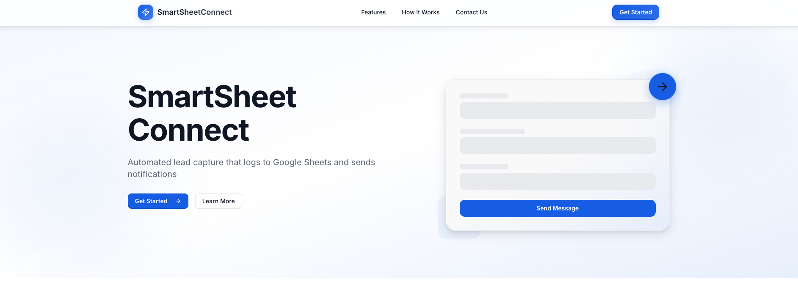
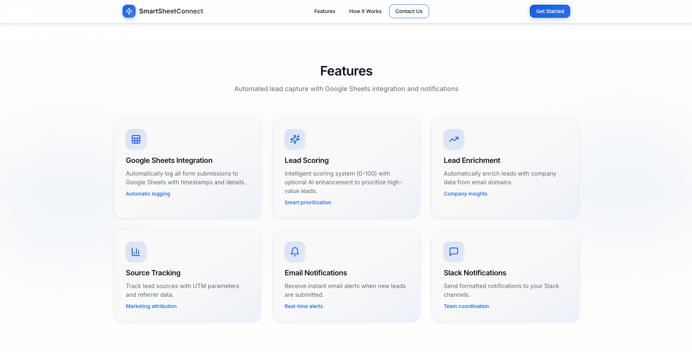
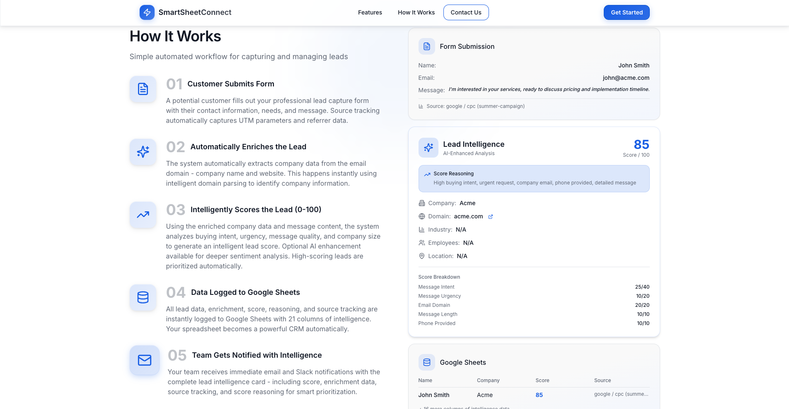
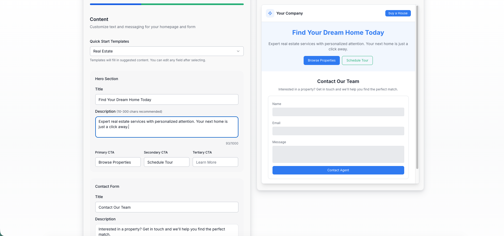
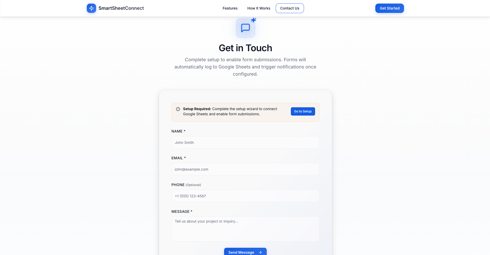
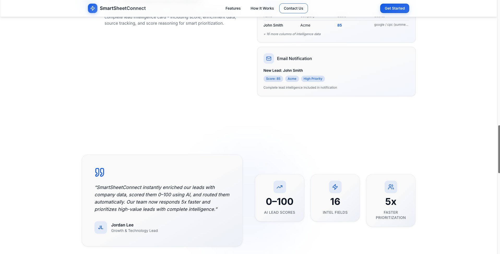

# 🧾 SmartSheetConnect — Frontend Portfolio

> **White-label lead capture platform** | Frontend codebase & design system

[](https://www.typescriptlang.org/)
[](https://reactjs.org/)
[](https://tailwindcss.com/)
[](https://ui.shadcn.com/)
[](https://vitejs.dev/)
[](https://vitest.dev/)
[](LICENSE)


**Frontend codebase for a white-label, embeddable lead capture platform. This repository contains the React/TypeScript frontend that makes real API calls, shared Zod validation schemas, and configuration files. The frontend is fully functional and expects a backend API (Express/Node.js services for lead processing, enrichment, scoring, Google Sheets integration, and notifications) which is proprietary and not included in this portfolio.**

> **📝 Note**: This repository contains the **frontend codebase and shared schemas**. The frontend makes real HTTP requests to backend APIs. Backend implementation code is proprietary and excluded. For backend licensing inquiries, contact info@lifesavertech.ca

---

## 📋 Table of Contents

- [Overview](#overview)
- [Visual Showcase](#-visual-showcase)
- [Technical Implementation](#technical-implementation)
- [Tech Stack](#-tech-stack)
- [Project Structure](#project-structure)
- [Quick Start](#-quick-start)
- [Development](#-development)
- [Testing](#-testing)
- [Implementation Details](#-implementation-details)
- [License](#license)

---

## Overview

Frontend codebase and shared schemas for a white-label lead capture platform. This repository contains the React/TypeScript frontend that makes real API calls to backend endpoints, shared Zod validation schemas used by both client and server, and configuration files. The frontend enables non-technical users to configure branding and content through a setup wizard, then embed forms into external websites. API calls will fail gracefully when the backend is not available.

**Core Challenges:**
- Runtime theming without rebuilds (white-label requirement)
- Cross-origin embeddable components with style isolation
- Multi-step configuration flow with progress persistence
- Type safety across frontend/backend boundary

**Technical Approach:**

**Dynamic Theming:** CSS variables set at runtime from user configuration, referenced by Tailwind utilities. Enables theme changes without component rebuilds or style injection. Trade-off: requires careful CSS variable management and Tailwind config structure.

**Embeddable Components:** Standalone components designed for iframe/script embedding. Styling isolated via CSS scoping to prevent host page conflicts. API endpoints configurable for multi-tenant deployments. Constraint: must handle CORS, CSP, and cross-origin communication.

**Shared Validation:** Zod schemas in `shared/` provide runtime validation and TypeScript types. Same schemas used on both sides of API boundary ensures consistency. Benefit: single source of truth for validation logic.

**State Management:** React Query for server state (caching, refetching, error handling). React Hook Form for form state with Zod validation. Local state for UI-only concerns. Separation prevents unnecessary re-renders and keeps concerns isolated.

**Implementation:**
- 35 React components (12 custom, 23 shadcn/ui base)
- TypeScript strict mode with end-to-end coverage
- Error boundaries and graceful degradation
- Component tests with Vitest, schema validation tests

---

## 🎨 Visual Showcase

<table>
  <tr>
    <td></td>
    <td><strong>Landing Page</strong> — Marketing landing page with hero section, features showcase, and call-to-action elements.</td>
  </tr>
  <tr>
    <td></td>
    <td><strong>Features Section</strong> — Overview of platform capabilities including Google Sheets integration, lead scoring, enrichment, and multi-channel notifications.</td>
  </tr>
  <tr>
    <td></td>
    <td><strong>How It Works</strong> — Step-by-step visual guide explaining the automated lead processing workflow from form submission to Google Sheets logging and team notifications.</td>
  </tr>
  <tr>
    <td></td>
    <td><strong>Setup Wizard</strong> — Multi-step configuration interface for customizing branding, content, Google OAuth integration, and notification channels. *(UI only - backend proprietary)*</td>
  </tr>
  <tr>
    <td></td>
    <td><strong>Embeddable Form</strong> — Standalone contact form with validation, error handling, and responsive design. Can be embedded into any website with custom styling.</td>
  </tr>
  <tr>
    <td></td>
    <td><strong>Analytics Dashboard</strong> — Data visualization and analytics showcasing platform metrics and lead intelligence.</td>
  </tr>
</table>

---

## Technical Implementation

**Dynamic Theming:**
Runtime CSS variable injection based on user configuration. Tailwind utilities reference these variables via `var(--primary)`, `var(--secondary)`, etc. Theme changes apply immediately without rebuilds. Implementation uses `:root` CSS variables scoped to prevent conflicts.

**Embeddable Components:**
Components designed for cross-origin embedding. Styling isolated via CSS modules and scoped selectors. API endpoints configurable via props for multi-tenant support. Handles CORS, CSP headers, and postMessage communication for iframe embedding.

**Type Safety:**
Zod schemas in `shared/schema.ts` generate TypeScript types via `z.infer`. Same schemas used for runtime validation on frontend and backend. Ensures API contract consistency and catches type mismatches at compile time.

**Error Handling:**
Error boundaries catch component tree failures. API errors surface user-facing messages via React Query error states. Application degrades gracefully when backend unavailable (shows configuration errors, falls back to defaults). Prevents UI crashes from API failures.

---

## 🛠️ Tech Stack

**Frontend:**
- React 18 with TypeScript
- Vite (build tool and dev server)
- Tailwind CSS (utility-first with dynamic theming)
- shadcn/ui (23 base components)
- Framer Motion (animations)
- React Hook Form + Zod (form validation)
- TanStack Query (server state management)
- Wouter (lightweight routing)

**Development & Quality:**
- TypeScript (strict mode, end-to-end type coverage)
- Vitest (component testing)
- Zod (runtime validation, type inference)
- ESLint + Prettier (code quality)

---

## Project Structure

```
portfolio/
├── client/                 # React frontend application
│   ├── src/
│   │   ├── components/     # React components (35 components)
│   │   │   ├── ui/         # shadcn/ui components
│   │   │   └── ...         # Custom components
│   │   ├── pages/          # Page components
│   │   │   ├── Home.tsx    # Landing page
│   │   │   ├── Setup.tsx   # Setup wizard
│   │   │   ├── Embed.tsx   # Embeddable form
│   │   │   └── not-found.tsx # 404 page
│   │   ├── hooks/          # Custom React hooks
│   │   ├── lib/            # Utilities and constants
│   │   └── main.tsx        # Application entry point
│   ├── public/             # Static assets
│   └── index.html          # HTML template
│
├── shared/                 # Shared code
│   ├── schema.ts           # Zod schemas for validation
│   └── schema.test.ts      # Schema validation tests
│
├── config/                 # Configuration files
│   └── branding.json       # Branding configuration
│
├── LICENSE                 # License file
├── README.md               # Project documentation
│
├── package.json            # Dependencies and scripts
├── tsconfig.json           # TypeScript configuration
├── vite.config.ts          # Vite configuration
├── tailwind.config.ts      # Tailwind CSS configuration
├── components.json         # shadcn/ui configuration
└── ...
```

### Key Modules

- `client/src/components/` — 35 React components (12 custom + 23 shadcn/ui)
- `client/src/pages/` — Landing page, setup wizard, embeddable form, 404 page
- `client/src/lib/` — Typed utilities, constants, validation
- `shared/schema.ts` — Zod schemas for form & lead types (shared validation)
- `client/src/index.css` — Design system CSS variables and utilities

---

## 🚀 Quick Start

**Prerequisites:**
- Node.js >= 18.0.0
- npm >= 9.0.0

**Installation:**

```bash
# Clone the repository
git clone https://github.com/lindseystead/smartsheetconnect-portfolio.git
cd smartsheetconnect-portfolio

# Install dependencies
npm install

# Run development server
npm run dev
```

The application will be available at `http://localhost:5173`

---

## 💻 Development

The frontend runs independently and can be fully developed without backend services. All UI components, design system elements, form validation, and user flows are functional.

**Error Handling:**
- API errors fall back to default configuration with user-facing messages
- Error boundaries ensure UI remains functional when API calls fail
- Client-side validation provides immediate feedback
- Components render correctly regardless of API availability

### Available Scripts

```bash
# Development
npm run dev              # Start development server
npm run build            # Build for production

# Code Quality
npm run check            # TypeScript type checking
npm run check:watch      # TypeScript type checking (watch mode)
npm run lint             # Run ESLint
npm run lint:fix         # Run ESLint with auto-fix
npm run format           # Format code with Prettier
npm run format:check     # Check code formatting

# Testing
npm test                 # Run tests in watch mode
npm run test:ui          # Run tests with UI
npm run test:coverage    # Run tests with coverage
npm run test:run         # Run tests once
```

### Code Style

- **TypeScript** — Strict mode enabled
- **ESLint** — Configured with TypeScript and React rules
- **Prettier** — Automatic code formatting

---

## 🧪 Testing

**Test Coverage:**
- Schema validation (Zod) — Edge cases, email validation, length constraints, phone format
- Component tests — User interactions, validation feedback, success/error states
- Type safety — Full TypeScript coverage with strict mode

**Testing Approach:**
- User experience validation
- Data integrity checks
- Edge case handling (boundary conditions, optional fields, malformed input)
- API integration mocking

**Running Tests:**

```bash
npm test                 # Watch mode
npm run test:ui          # Interactive UI
npm run test:coverage    # Coverage report
npm run test:run         # CI mode
```

---

## 📦 Implementation Details

**Component Structure:**
Feature-based organization with shared UI components. Custom components extend shadcn/ui base with domain-specific logic. Hooks encapsulate data fetching and form state. Utilities in `lib/` provide typed helpers and constants.

**State Management Strategy:**
- Server state: React Query (caching, background refetching, error retry)
- Form state: React Hook Form (validation, field-level errors, submission handling)
- UI state: Local useState for modals, toggles, temporary UI concerns
- Configuration: React Query with long staleTime for user branding/content config

**Design System:**
CSS variables defined in `index.css`, referenced by Tailwind config. Custom utilities extend Tailwind for design tokens. shadcn/ui provides base components, custom components add domain logic. Mobile-first breakpoints with responsive utilities.

**Type Safety:**
TypeScript strict mode across codebase. Zod schemas provide runtime validation and type inference. Shared schemas ensure frontend/backend contract consistency. No `any` types, explicit error handling.

---

## License

Copyright (c) 2025 Lindsey D. Stead

All rights reserved.

This software and its associated documentation files are provided for portfolio and evaluation purposes only.

No part of this software, including source code, compiled binaries, screenshots, documentation, or design, may be copied, modified, published, redistributed, sublicensed, sold, or used in any production, commercial, or training environment without explicit, written permission from the copyright holder.

Permission is granted to recruiters and hiring managers to view this repository for the sole purpose of evaluating the author's technical skills. No other use is permitted.

THE SOFTWARE IS PROVIDED "AS IS", WITHOUT WARRANTY OF ANY KIND, EXPRESS OR IMPLIED, INCLUDING BUT NOT LIMITED TO THE WARRANTIES OF MERCHANTABILITY, FITNESS FOR A PARTICULAR PURPOSE AND NONINFRINGEMENT. IN NO EVENT SHALL THE AUTHORS OR COPYRIGHT HOLDERS BE LIABLE FOR ANY CLAIM, DAMAGES OR OTHER LIABILITY, WHETHER IN AN ACTION OF CONTRACT, TORT OR OTHERWISE, ARISING FROM, OUT OF, OR IN CONNECTION WITH THE SOFTWARE OR THE USE OR OTHER DEALINGS IN THE SOFTWARE.

For licensing inquiries, contact: info@lifesavertech.ca

---

<p align="center">
  <i>Production-ready frontend codebase built with real engineering discipline.</i>
</p>
